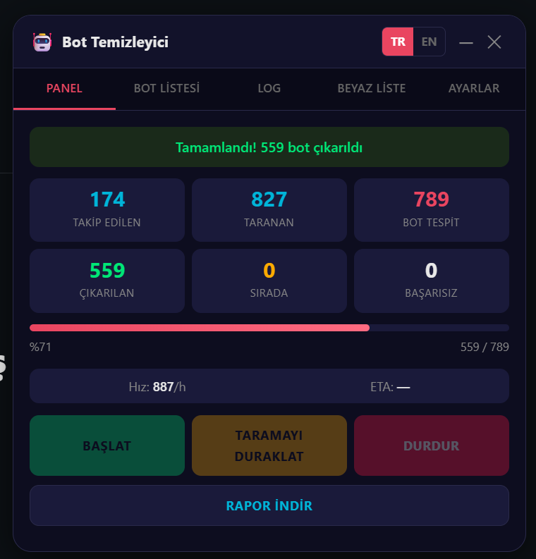

# InstaGhost - Instagram Bot Follower Remover

A browser-based tool that identifies and removes bot/spam followers from your Instagram account. It detects followers you don't follow back, scores them based on bot-likelihood signals, and removes them automatically with an advanced anti-detection engine.


---

<p align="center">
  
</p>

---

## What's New in v4

- **Gaussian Jitter** — Human-like delay distribution (Box-Muller transform) instead of uniform random
- **Adaptive Throttle** — Monitors API response times and proactively slows down before hitting rate limits
- **Micro-Batch Strategy** — Smaller, more frequent batches with shorter pauses for a natural pattern
- **Session Health Check** — Periodic session validity checks to prevent wasted requests
- **Real Instagram Headers** — Full header set matching the actual web client (`x-asbd-id`, `x-web-session-id`, proper `referrerPolicy`)
- **Dual API Engine** — GraphQL primary (50/page) with REST API fallback (12/page), auto-switches on rate limit
- **Correct API Endpoints** — Uses `search_surface=follow_list_page` and `count=12` matching the real Instagram UI
- **Backoff Jitter** — Randomized ±20% variation on backoff times for unpredictable retry patterns

---

## Features

### Bot Detection & Scoring
- **Smart Bot Score** (0-11 scale) — accounts are scored based on multiple signals:
  - No profile picture (+4)
  - Numeric/gibberish username (+3)
  - Empty display name (+2)
  - Display name matches username (+1)
  - Excessive underscores/dots in username (+1)
  - Private account (+1)
  - Verified account (-10)
- Color-coded scores: Green (0-2 Low), Yellow (3-5 Medium), Red (6+ High)
- Removal queue sorted by score — highest-probability bots are removed first

### Concurrent Architecture
- Fetches followers and removes bots **simultaneously** — doesn't wait for the full list before starting removal
- Scan and removal run as independent async workers via `Promise.all`

### Advanced Anti-Detection Engine

#### Gaussian Delay Distribution
Standard tools use uniform random delays (`Math.random()` between min and max), which creates a flat, detectable pattern. InstaGhost v4 uses a **Box-Muller transform** to generate normally distributed delays — most values cluster around the center with occasional outliers, mimicking real human behavior.

```
Uniform Random:   |████████████████████|  (flat — every delay equally likely)
Gaussian Random:  |   ▁▃▅▇████▇▅▃▁    |  (bell curve — natural clustering)
```

#### Adaptive Response Time Throttle
The engine tracks the last 10 API response times using a sliding window. When Instagram's servers start responding slower (a precursor to rate limiting), the tool **proactively increases delays** before a 429 ever arrives:

- Response time > 1.8x average → automatic slowdown (up to 3x multiplier)
- Visual indicator in the UI when adaptive throttle is active
- Multiplier resets after mega batch pauses

#### Micro-Batch Strategy
Instead of large batches with long pauses (detectable pattern), v4 uses smaller, more frequent batches:

| v3 (Old) | v4 (New) |
|----------|----------|
| 18 removals → 3-5.5 min pause | 6 removals → 50-110s pause |
| 55 removals → 10-15 min mega pause | 30 removals → 5-9 min mega pause |
| Predictable large cycles | Frequent short cycles (harder to fingerprint) |

#### Session Health Monitoring
Every 5 minutes, the engine validates the current session by calling `/api/v1/users/{uid}/info/`. If the session is degraded, it pauses proactively instead of burning through rate limit budget with failing requests.

#### Dual API Engine (GraphQL + REST)
The tool uses **two separate Instagram APIs** with automatic failover:

```
┌─────────────────────────────────────────────────────────┐
│  START → GraphQL API (50 followers/page — 4x faster)    │
│            │                                            │
│            ├── 429 Rate Limit?                          │
│            │     └── Switch to REST API (12/page)       │
│            │           └── 10 min later → retry GraphQL │
│            │                                            │
│            ├── REST also 429?                           │
│            │     └── Exponential backoff with jitter    │
│            │                                            │
│            └── Success → process users → next page      │
└─────────────────────────────────────────────────────────┘
```

- **GraphQL** (`/graphql/query/`): Fetches 50 followers per request via `edge_followed_by`
- **REST** (`/api/v1/friendships/`): Fetches 12 followers per request (matches real UI)
- **Separate rate limit buckets** — when one API is limited, the other often still works
- Auto-switches back to GraphQL after 10 minutes (configurable)
- Total follower count reported from GraphQL response
- Log entries show `[GQL]` or `[REST]` to indicate active API

#### Real Browser Fingerprint
Requests include the full Instagram web client header set:

| Header | Purpose |
|--------|---------|
| `x-asbd-id` | Instagram client identifier |
| `x-web-session-id` | Browser session tracking (3-segment format) |
| `x-ig-app-id` | Instagram web app ID |
| `x-ig-www-claim` | Session claim token (auto-refreshed) |
| `x-csrftoken` | CSRF protection token |
| `referrerPolicy` | `strict-origin-when-cross-origin` |
| `search_surface` | `follow_list_page` (matches real UI context) |

GET and POST requests use separate header sets (no `content-type` on GETs).

### Rate Limit Safety
- Gaussian delays between removals (22-42s center, with natural variance)
- Micro-batch pauses: every 6 removals → 50-110s break
- Mega batch pauses: every 30 removals → 5-9 min break
- Adaptive slowdown on response time spikes (proactive, before 429)
- Exponential backoff with ±20% jitter on 429 responses (10min → ×1.8 → max 60min)
- Consecutive error detection with automatic cooldown (6 errors → 15 min)
- Session health checks every 5 minutes
- **Designed to run unattended** — leave your computer on and walk away

### Full UI Panel
- Draggable floating panel with dark theme
- 5 tabs: **Dashboard**, **Bot List**, **Log**, **Whitelist**, **Settings**
- Real-time stats: following count, scanned followers, bots found, removed, queued, failed
- Progress bar with percentage, speed (removals/hour), and ETA
- Adaptive throttle indicator (purple phase when active)
- Minimizable panel that stays out of the way

### Whitelist
- Protect specific accounts from ever being removed
- Add by username directly in the UI
- Import/export whitelist as JSON for backup
- Whitelisted accounts are automatically skipped during removal

### Bulk Selection
- Checkboxes on each bot entry for manual selection
- Select All / Deselect All buttons
- "Remove Selected" to target specific accounts
- Filter views: All, No Profile Picture, High Score, Selected

### Filters & Search
- Search bots by username or display name
- Filter by: no profile picture, high bot score, selected items
- Profile picture indicator icon on accounts with default/missing avatars

### Smart Pause
- Pause button **only pauses scanning** — removal continues from the existing queue
- Stop button halts everything and saves state

### Persistence & Resume
- Full state saved to `localStorage` — survives page refreshes
- Resume from where you left off after closing the tab
- Cursor-based pagination state preserved for followers fetch

### Bilingual Interface
- Turkish (TR) and English (EN) language support
- Instant switch from the UI — no reload needed
- 100+ localized strings covering all UI elements

### Configurable Settings
- Fetch speed (min/max delay, items per page)
- Remove speed (min/max delay between removals)
- Batch size and pause duration
- Mega batch size and pause duration
- Reset button to clear all saved data

### Export
- Download detailed JSON reports with:
  - Engine version and type
  - Following count, scanned count, bots found
  - Full removed list with timestamps
  - Failed list with error codes
  - Remaining queue count

---

## Usage

1. Open [instagram.com](https://www.instagram.com) and log in to your account
2. Open browser DevTools (`F12` or `Ctrl+Shift+I`)
3. Go to the **Console** tab
4. Copy the entire contents of `bot_delete.js` and paste it into the console
5. Press **Enter** — the Bot Cleaner panel will appear
6. Click **START** and let it run

> **Tip:** You can minimize the panel and continue browsing. The tool runs in the background.

---

## How It Works

```
 1. Fetches your Following list via REST API (/api/v1/friendships/{uid}/following/)
 2. Fetches your Followers via GraphQL API (50/page, fast scan)
    └── If GraphQL rate limited → auto-switch to REST API (12/page)
    └── After 10 min cooldown → retry GraphQL
 3. Compares: followers NOT in your following list = potential bots
 4. Scores each bot based on profile signals (0-11 scale)
 5. Queues bots sorted by score (highest first)
 6. Removes bots via Instagram's remove_follower REST API
 7. Steps 2-6 run concurrently — removal starts immediately
 8. Adaptive throttle monitors response times throughout all phases
 9. Session health checks run every 5 minutes during removal
10. Duplicate detection via Set — API switches never cause double-processing
```

---

## Rate Limit Strategy

| Event | Action |
|-------|--------|
| Normal removal | 22-42s Gaussian delay (bell curve distribution) |
| Every 6 removals | 50-110s micro-batch pause |
| Every 30 removals | 5-9 min mega pause |
| Response time spike | Adaptive slowdown (1.0x → up to 3.0x multiplier) |
| GraphQL 429 | Instantly switch to REST API (no wait!) |
| REST 429 | Exponential backoff with jitter (10min → ×1.8 → max 60min) |
| 6 consecutive errors | 15 min emergency cooldown |
| Every 5 minutes | Session health check |
| Every 10 minutes | Retry GraphQL if previously disabled |
| HTTP 401/403 | CSRF refresh + retry |

Estimated throughput: **~60-80 removals/hour** (lower than v3 but significantly safer)

> **Key insight:** GraphQL and REST APIs use separate rate limit buckets. When GraphQL hits a 429, the tool instantly switches to REST — no waiting. This means the scanning phase almost never stalls.

---

## v3 vs v4 Comparison

| Feature | v3 | v4 |
|---------|----|----|
| Follower fetch API | REST only (single endpoint) | **Dual: GraphQL + REST** (auto-failover) |
| Fetch page size | 100 per request | GraphQL: 50, REST: 12 (matches real UI) |
| Rate limit buckets | 1 (REST only) | **2 (GraphQL + REST — separate limits)** |
| Delay distribution | Uniform random | Gaussian (Box-Muller) |
| Batch size | 18 removals | 6 removals (micro-batch) |
| Mega batch | 55 removals | 30 removals |
| Rate limit detection | Reactive (wait for 429) | Proactive (response time monitoring) |
| GraphQL 429 handling | N/A | **Instant switch to REST (zero downtime)** |
| Backoff strategy | Fixed exponential | Exponential with ±20% jitter |
| Session monitoring | None | Health check every 5 min |
| API headers | 5 headers | 7 headers (full web client match) |
| API endpoint | Basic URL | `search_surface=follow_list_page` |
| GET/POST headers | Same for both | Separate (no content-type on GET) |
| Throughput | ~80-100/hour | ~60-80/hour |
| Detection risk | Moderate | Low |

---

## Bot Score Breakdown

| Signal | Points | Rationale |
|--------|--------|-----------|
| No profile picture | +4 | Strongest bot indicator |
| Numeric username (50%+ digits) | +3 | Auto-generated account pattern |
| Empty display name | +2 | Minimal profile effort |
| Display name = username | +1 | No personalization |
| 3+ consecutive underscores/dots | +1 | Generated username pattern |
| Private account | +1 | Common for spam accounts |
| Verified account | -10 | Extremely unlikely to be a bot |

---

## Disclaimer

This tool interacts with Instagram's private API. Use it at your own risk. Excessive or aggressive usage may result in temporary action blocks or account restrictions. The default rate limit settings are conservative and designed to minimize risk, but Instagram may change their limits at any time.

This tool is intended for personal use to clean your own account. Do not use it to harass or mass-remove legitimate followers.

---

## License

MIT
